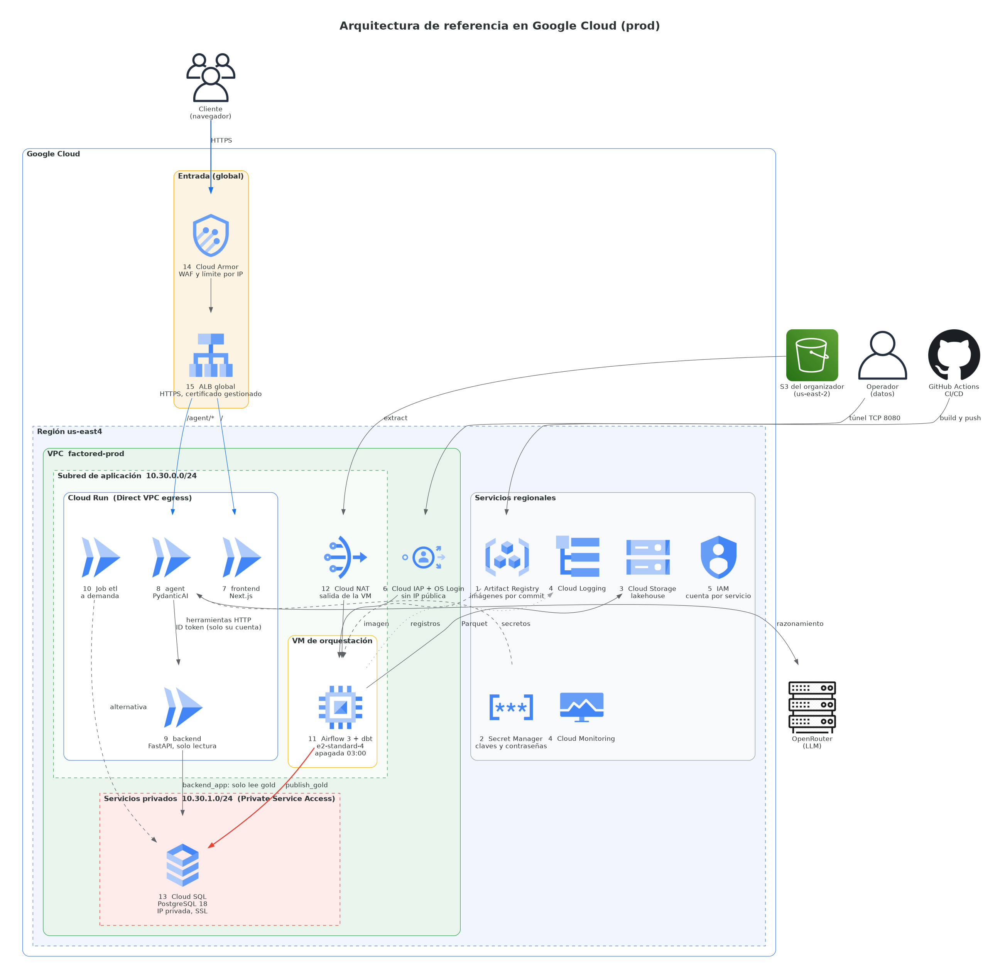

# Arquitectura en Google Cloud (prod, us-east4)

Generado con la biblioteca `diagrams` (mingrammer): `python gcp_architecture.py` (requiere `pip install diagrams` y Graphviz). Salida: `gcp-architecture.png` y `.svg`.

## Leyenda
| N.º | Componente | Qué es |
|---|---|---|
| 1 | Artifact Registry | Imágenes versionadas por commit |
| 2 | Secret Manager | Claves, JWT y contraseñas; un acceso por servicio |
| 3 | Cloud Storage | Lakehouse: bronze y silver en Parquet |
| 4 | Cloud Logging y Monitoring | Registros y métricas de la VM y la base |
| 5 | IAM | Una cuenta de servicio por componente |
| 6 | Cloud IAP + OS Login | Único acceso a la VM, sin IP pública |
| 7 | frontend | Interfaz web (Next.js) |
| 8 | agent | Política de disputas (PydanticAI) |
| 9 | backend | API FastAPI de solo lectura sobre gold |
| 10 | Job etl | El mismo pipeline, lanzado a demanda |
| 11 | Airflow 3 + dbt | VM e2-standard-4, DAG de 7 tareas, apagada a las 03:00 |
| 12 | Cloud NAT | Única salida a internet de la VM |
| 13 | Cloud SQL | PostgreSQL 18, IP privada, SSL; solo se publica gold. Roles: `app` (pipeline), `backend_app` (lee gold), `agent_app` (auditoría) |
| 14 | Cloud Armor | Reglas de inyección SQL, XSS y Log4j, y límite por IP |
| 15 | ALB global | Única entrada pública: `/` al frontend y `/agent/*` al agente; el acceso directo está cerrado. El backend solo acepta la cuenta del agente |

## Límites
- Cloud Run no vive literalmente dentro de la subred: se conecta con Direct VPC egress; se dibuja dentro para mostrar esa relación.
- El navegador llama al agente por el mismo origen del ALB (`/agent/*`), por eso no hay flecha directa frontend → agente.
- Un solo ambiente (prod). OpenRouter usa un ícono genérico (no hay uno oficial).
- Las etiquetas de algunas flechas pueden quedar cerca de otros elementos: Graphviz coloca el layout solo.
