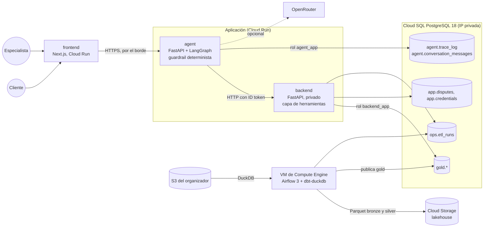

# Arquitectura

[Índice](README.md) · [Workflow](WORKFLOW.md) · [Arquitectura](ARCHITECTURE.md) · [Datos](DATA.md) · [API](API.md)

El asistente de disputas de transacciones de LATAM Bank (workflow A, ver [Workflow](WORKFLOW.md)) corre en GCP. Este documento describe lo que está desplegado y por qué, por verticales. Lo que se descartó por el camino está al final.

## Panorama

## Despliegue

Todo es Terraform en `infra/gcp/`, en tres ambientes (`dev`, `qa`, `prod`) con módulos compartidos. El detalle por módulo y por ambiente está en `infra/gcp/README.md`; aquí solo lo que importa para entender el diseño.

- **Borde.** Un Application Load Balancer con Cloud Armor (reglas WAF antes del límite de tasa) está delante del frontend y del agente. El backend no es público: el agente lo llama con un ID token de su cuenta de servicio.
- **Red.** Una VPC por ambiente. Cloud Run sale por Direct VPC egress y Cloud SQL solo tiene IP privada (Private Service Access). La VM de Airflow no tiene IP externa y se entra por IAP.
- **Identidades.** Cada servicio tiene su cuenta de servicio y lee solo los secretos que necesita. En la base cada servicio tiene su propio rol (`backend_app`, `agent_app`). El despliegue desde GitHub Actions usa federación de identidad, sin llaves guardadas.
- **Imágenes y secretos.** Artifact Registry y Secret Manager. Las llaves del S3 del organizador y la de OpenRouter se cargan a mano; un `apply` no las pisa.
- **Costo.** La VM de Airflow se apaga sola de noche y se enciende a demanda (`scripts/airflow_vm.sh`). Cloud SQL se puede pausar (`scripts/manage_db.sh`).

## 1. Extracción y carga

**Responsabilidad:** llevar los CSV del organizador (S3) hasta tablas consultables, sin perder lo crudo, y dejar `gold` listo para el backend.

Airflow 3 corre en la VM (`infra/airflow-gcp/`, DAG `latam_bank_gcp`). Cada corrida:

1. DuckDB lee los CSV de S3 en paralelo, sin bajar archivos, y escribe **bronze** como Parquet en el lakehouse, con el objeto de origen (`_source_key`) y la hora de carga como linaje.
2. dbt (`dbt-duckdb`, en la misma VM) construye **silver** y **gold** en RAM: tipos reales, vacío a nulo, países conformados, y las pruebas de datos.
3. Si las pruebas de silver pasan, publica solo `gold.*` en Cloud SQL y deja una fila en `ops.etl_runs`. Si fallan, `gold` conserva el último dato válido.
4. Publica la documentación de dbt con el grafo de linaje (`scripts/lineage.sh`).

Las etapas compartidas viven en `data/pipeline/` y las prueba su propia suite. El mismo código corre como Cloud Run Job (`infra/gcp/etl/`), el camino de respaldo si la VM no está.

**Por qué DuckDB y Parquet:** el dato son 23,5 millones de filas en 13 tablas. Procesarlas en memoria y guardar lo intermedio como Parquet en Cloud Storage cuesta centavos al mes, mantiene Cloud SQL libre de tablas crudas y deja bronze y silver auditables. Con el job en Cloud Run se midieron ~2,5 minutos para leer y procesar todo.

**Política de actualización y frescura.**
- El dato es un snapshot cerrado: las tablas transaccionales van del 2023-06-17 al 2026-06-18 y no llega nada nuevo. Se verificó que no hay llegadas tardías ni cambios de esquema entre fechas.
- La actualización es una recarga completa a demanda. Cada corrida reconstruye bronze desde S3.
- "Fresco" significa la hora de la última corrida exitosa: queda en `ops.etl_runs`, la devuelve `GET /meta/data` y la muestra la consola. No hay umbral de antigüedad que vigilar porque la fuente no cambia.
- Si el dato empezara a llegar: programar el DAG, pasar `transactions` y `digital_events` a incrementales por partición, y declarar `loaded_at_field: _ingested_at` en las fuentes para que `dbt source freshness` avise cuando una tabla se atrase.

**Escalabilidad.** La carga completa cabe en una VM de 4 CPU y 16 GB. Si el volumen creciera 10 veces, los puntos de extensión son filtrar por partición (`year/month/day` ya es una columna) y los modelos incrementales. Está documentado como camino, no implementado.

## 2. Calidad de datos: dbt

**Responsabilidad:** resolver lo que se encontró en [Datos](DATA.md) (nulos, MXN ausente, tipos, valores inconsistentes) y dejar `gold` en el contrato que consume el backend. Proyecto en `data/dbt/`.

- Modelos `stg_*` en silver para las 13 tablas y un modelo por entidad en gold (sin prefijo `clean_`: la limpieza es de silver).
- Las pruebas son los contratos: claves, claves foráneas entre todas las tablas, valores aceptados, rangos y reglas de negocio. Los defectos conocidos del dataset corren como advertencias con su conteo, para que aparezcan en cada corrida sin bloquearla.
- `dbt build` prueba cada modelo antes de construir los que dependen de él.

## 3. Capa de herramientas: backend

**Responsabilidad:** es el "service/tool layer" que el reto pide: los permisos se hacen cumplir aquí, no en el prompt. FastAPI con asyncpg, en `backend/`. El contrato endpoint por endpoint está en [API](API.md) y el de OpenAPI está versionado, con una prueba que falla si el código se desvía.

- **Sesión:** JWT firmado (HS256, emisor `backend-sandbox`) con vencimiento y rol `customer` o `admin`. Las cuentas de demostración usan contraseña con bcrypt y bloqueo por intentos. Es un sandbox y se presenta como tal.
- **Titularidad:** toda consulta se filtra por el cliente del token. Pedir una transacción o un caso ajeno devuelve 404, no 403, para no confirmar que existe.
- **Casos:** un caso por cliente y transacción (índice único parcial), con estados `open`, `auto_resolved`, `escalated`, `in_progress` y `closed`, sus eventos y la evidencia. Las migraciones están versionadas (`app/migrations/`, con candado de asesoría).
- **Solo lectura sobre los datos:** el rol `backend_app` lee `gold` y escribe únicamente en `app.*`.
- **Consola del especialista:** `/admin/*` para tomar, cerrar y resolver casos con transiciones auditadas, más métricas.

## 4. Agente y guardrail

**Responsabilidad:** hablar con el cliente, decidir, llamar a las herramientas, verificar y escalar. FastAPI con LangGraph, en `agent/`.

El flujo es `understand → decide → act → verify → respond | escalate`:

- **`decide` es código, no un modelo.** El guardrail (`app/guardrail.py`) aplica la política: resuelve solo un cobro `Declined` o `Reversed` por debajo de USD 500; pide aclaración si hay cero o varias candidatas; escala un cobro aprobado, un posible fraude, un monto sobre el umbral, un monto desconocido o algo fuera de alcance.
- **`verify` relee el caso del backend** antes de decir que se registró. Si no coincide, escala. El agente no reporta lo que no comprobó.
- **El modelo es opcional y no decide.** Con una clave de OpenRouter clasifica la intención de mensajes que las palabras clave no cubren y redacta la respuesta de un caso ya resuelto. Ese borrador pasa por `app/grounding.py` (sin plazos ni promesas, sin números que no estén en los hechos, sin identificadores) y, si falla, sale la plantilla. Sin clave, el agente es determinista.
- **Fallas:** tres intentos acotados por herramienta (peor caso ~6,9 s). Si el backend no responde, el resultado es `unavailable` con un mensaje seguro y sin cambios.
- **Trazabilidad:** `agent.trace_log` guarda cada paso con su resultado y latencia, sin texto del cliente ni razonamiento del modelo. Es la evidencia de auditoría.
- **Historial:** `agent.conversation_messages` guarda lo que el cliente escribió y lo que se le respondió, para que pueda volver a sus conversaciones. Es la tabla a la que aplicaría la política de retención, y solo la lee su dueño.
- **Handoff:** entrega la solicitud, los hechos verificados, las acciones tomadas, la evidencia y las preguntas abiertas, no un volcado de la conversación.
- **Datos de fraude:** `is_fraud` y `fraud_score` son verdad de referencia sintética y no son entrada del agente.

## 5. Frontend

Next.js 16 en Cloud Run (`output: standalone`, `AGENT_URL` en tiempo de ejecución). Chat del cliente con historial, tarjetas de evidencia y tema claro u oscuro, en español y portugués; consola del especialista en `/admin`; documentación de datos en `/data-docs`.

## Qué falta para producción real

El reto pide ser honesto aquí. Los controles que hoy son de sandbox y lo que se necesitaría están en `CRITERIA.md` (sección "Ruta a producción"); la falta principal es el documento que cubra capacidad, monitoreo, accesos, retención y separación de la base de datos de la aplicación y la del pipeline.

## Lo que se descartó

- **Railway y Vercel.** Se empezó ahí y se migró todo a GCP; el proyecto de Railway se eliminó. El código y las especificaciones viejas están en el historial de git.
- **Airbyte.** Se intentó autoalojar Airbyte OSS para la extracción. Exigía Temporal, Elasticsearch y un Postgres aparte, y su único camino oficial hoy es un clúster de Kubernetes. Se reemplazó por DuckDB, que lee S3 y escribe en una sola sentencia.
- **PydanticAI.** El agente se implementó con LangGraph; el flujo `understand → decide → act → verify` es un grafo explícito.
- **TypeSafe (Jev).** Se evaluó como clasificador hospedado (la investigación de componentes). Nunca hubo clave y se quitó el código que lo llamaba.
- **Workflow de crédito.** Descartado a favor de disputas (ver [Workflow](WORKFLOW.md)).
