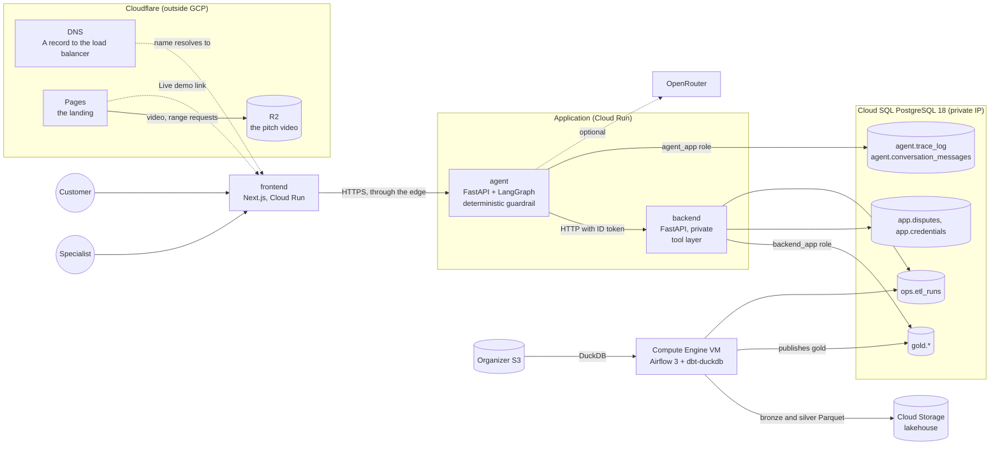

# Architecture

[Index](README.md) · [Workflow](WORKFLOW.md) · [Architecture](ARCHITECTURE.md) · [Data](DATA.md) · [API](API.md)

The LATAM Bank transaction dispute assistant (workflow A, see [Workflow](WORKFLOW.md)) runs on GCP. This document describes what is deployed and why, one vertical at a time. What was discarded along the way is at the end.

## Overview

## Deployment

Everything is Terraform in `infra/gcp/`, in three environments (`dev`, `qa`, `prod`) with shared modules. The per-module and per-environment detail is in `infra/gcp/README.md`; this section covers only what matters to understand the design. The deployment procedure is in [Deployment](DEPLOY.md).

- **Edge.** An Application Load Balancer with Cloud Armor (WAF rules before the rate limit) sits in front of the frontend and the agent. The backend is not public: the agent calls it with an ID token from its service account.
- **Network.** One VPC per environment. Cloud Run egresses through Direct VPC egress and Cloud SQL has only a private IP (Private Service Access). The Airflow VM has no external IP and is reached through IAP.
- **Identities.** Each service has its own service account and reads only the secrets it needs. In the database each service has its own role (`backend_app`, `agent_app`). Deployment from GitHub Actions uses identity federation, with no stored keys.
- **Images and secrets.** Artifact Registry and Secret Manager. The organizer's S3 keys and the OpenRouter key are loaded by hand, and an `apply` does not overwrite them.
- **Cost.** The Airflow VM stops by itself at night and starts on demand (`scripts/airflow_vm.sh`). Cloud SQL can be paused (`scripts/manage_db.sh`).
- **Domain.** The app's name is a DNS record in Cloudflare that points at the load balancer's address, without Cloudflare's proxy, because Google issues the managed certificate by looking at where the name resolves. A name can be added without interrupting the current one: each extra domain gets its own certificate next to the main one (`edge_additional_domains`). The names are repository variables, not code.
- **Landing and video.** The landing is a static export of `site/` on Cloudflare Pages, and the pitch video is an object in an R2 bucket: Pages ignores range requests, so a video served from it plays but cannot be skipped through. Both are in `infra/cloudflare` (the Pages project, the bucket, its public address and the DNS record), with their own state and their own workflow, apart from the application. Details in [Deployment](DEPLOY.md).
- **Monitoring.** Cloud Run and Cloud SQL report their default metrics and logs. No alerts, dashboards or uptime checks are defined yet (see [Path to production](PRODUCTION.md)).

## 1. Extraction and loading

**Responsibility:** take the organizer's CSV files (S3) to queryable tables without losing the raw data, and leave `gold` ready for the backend.

Airflow 3 runs on the VM (`infra/gcp/airflow/`, DAG `latam_bank_gcp`). Each run:

1. DuckDB reads the CSV files from S3 without downloading them and writes **bronze** as Parquet in the lakehouse, with the source object (`_source_key`) and the load time as lineage.
2. dbt (`dbt-duckdb`, on the same VM) builds **silver** and **gold** in memory: real types, empty to null, conformed countries, and the data tests.
3. If the silver tests pass, it publishes only `gold.*` to Cloud SQL and writes a row to `ops.etl_runs`. If they fail, `gold` keeps the last valid data.
4. It publishes the dbt documentation with the lineage graph (`scripts/lineage.sh`).

The shared stages live in `data/pipeline/` and have their own test suite. The same code runs as a Cloud Run Job (`infra/gcp/etl/`), the fallback path when the VM is not available.

**Why DuckDB and Parquet:** the data is 23.5 million rows in 13 tables. Processing them in memory and storing the intermediate layers as Parquet in Cloud Storage costs cents per month, keeps raw tables out of Cloud SQL and leaves bronze and silver auditable. With the Cloud Run job, reading and processing everything took about 2.5 minutes.

**Refresh and freshness policy.**
- The data is a closed snapshot: the transactional tables run from 2023-06-17 to 2026-06-18 and nothing new arrives. No late arrivals or schema changes between dates were found.
- A refresh is a full reload on demand. Each run rebuilds bronze from S3.
- "Fresh" means the time of the last successful run. It is stored in `ops.etl_runs`, returned by `GET /meta/data` and shown in the console. There is no age threshold to watch because the source does not change.
- If data started to arrive: schedule the DAG, make `transactions` and `digital_events` incremental by partition, and declare `loaded_at_field: _ingested_at` on the sources so that `dbt source freshness` warns when a table falls behind.

**Scalability.** The full load fits on a VM with 4 CPUs and 16 GB. If volume grew 10 times, the extension points are filtering by partition (`year/month/day` is already a column) and incremental models. This is documented as a path, not implemented.

## 2. Data quality: dbt

**Responsibility:** resolve what was found in [Data](DATA.md) (nulls, missing MXN, types, inconsistent values) and leave `gold` in the contract the backend consumes. The project is in `data/dbt/`.

- `stg_*` models in silver for the 13 tables and one model per entity in gold (no `clean_` prefix: cleaning belongs to silver).
- The tests are the contracts: keys, foreign keys across all tables, accepted values, ranges and business rules. Known dataset defects run as warnings with their counts, so they show up in every run without blocking it.
- `dbt build` tests each model before building the ones that depend on it.

## 3. Tool layer: backend

**Responsibility:** this is the "service/tool layer" the challenge asks for. Permissions are enforced here, not in the prompt. FastAPI with asyncpg, in `backend/`. The endpoint-by-endpoint contract is in [API](API.md), and the OpenAPI document is versioned, with a test that fails if the code drifts from it.

- **Session:** a signed JWT (HS256, issuer `backend-sandbox`) with an expiry and a `customer` or `admin` role. The demo accounts use argon2id passwords with lockout after failed attempts. The specialist console uses bcrypt hashes stored in Secret Manager. It is a sandbox and is presented as one.
- **Ownership:** every query is filtered by the customer in the token. Asking for someone else's transaction or case returns 404, not 403, so it does not confirm that it exists.
- **Cases:** one case per customer and transaction (a partial unique index), with statuses `open`, `auto_resolved`, `escalated`, `in_progress` and `closed`, their events and the evidence. Migrations are versioned (`app/migrations/`, with an advisory lock).
- **Read-only on the data:** the `backend_app` role reads `gold` and writes only to `app.*`.
- **Specialist console:** `/admin/*` to take, close and resolve cases with audited transitions, plus metrics.

## 4. Agent and guardrail

**Responsibility:** talk to the customer, decide, call the tools, verify and escalate. FastAPI with LangGraph, in `agent/`.

The flow is `understand → decide → act → verify → respond | escalate`:

- **`decide` is code, not a model.** The guardrail (`app/guardrail.py`) applies the policy. It resolves a `Declined` or `Reversed` charge below USD 500 on its own, asks for clarification when there are zero or several candidates, escalates an approved charge, suspected fraud, an amount over the threshold and an unknown amount, and declines what is out of scope, with no case or handoff.
- **`verify` rereads the case from the backend** before saying it was recorded. If it does not match, it escalates. The agent does not report what it did not check.
- **The model is optional and does not decide.** With an OpenRouter key it classifies the intent of messages the keywords do not cover, gives a second look for fraud that can only add caution (the phrase list stays the floor) and drafts the reply for an already resolved case. That draft passes through `app/grounding.py` (no deadlines or promises, no numbers that are not in the facts, no identifiers) and, if it fails, the template is sent. Without a key, the agent is deterministic.
- **Failures:** three bounded attempts per tool (worst case about 6.9 s). If the backend does not answer, the result is `unavailable` with a safe message and no changes.
- **Traceability:** `agent.trace_log` stores each step with its result and latency, with no customer text or model reasoning. It is the audit evidence.
- **History:** `agent.conversation_messages` stores what the customer wrote and what they were answered, so they can return to their conversations. It is the table a retention policy would apply to, and only its owner reads it.
- **Handoff:** it delivers the request, the verified facts, the actions taken, the evidence and the open questions, not a dump of the conversation.
- **Fraud data:** `is_fraud` and `fraud_score` are synthetic ground truth and are not agent inputs.

## 5. Frontend

Next.js 16 on Cloud Run (`output: standalone`, `AGENT_URL` read at run time). The customer chat has history, evidence cards and a light or dark theme, in Spanish and Portuguese. The specialist console is at `/admin` and the data documentation at `/data-docs`.

## What is missing for real production

The challenge asks for honesty here. [Path to production](PRODUCTION.md) lists what is sandbox today and what a real deployment would need: capacity, monitoring, access, retention and separating the application database from the pipeline's.

## What was discarded

- **Railway and Vercel.** The project started there and moved entirely to GCP. The Railway project was deleted. The old code and specifications are in the git history.
- **Airbyte.** Self-hosting Airbyte OSS for extraction was tried. It needed Temporal, Elasticsearch and a separate Postgres, and its only official path today is a Kubernetes cluster. DuckDB replaced it, reading S3 and writing in a single statement.
- **PydanticAI.** The agent was implemented with LangGraph. The `understand → decide → act → verify` flow is an explicit graph.
- **TypeSafe (Jev).** It was evaluated as a hosted classifier (the component research). There was never a key, and the code that called it was removed.
- **Credit workflow.** Dropped in favor of disputes (see [Workflow](WORKFLOW.md)).
