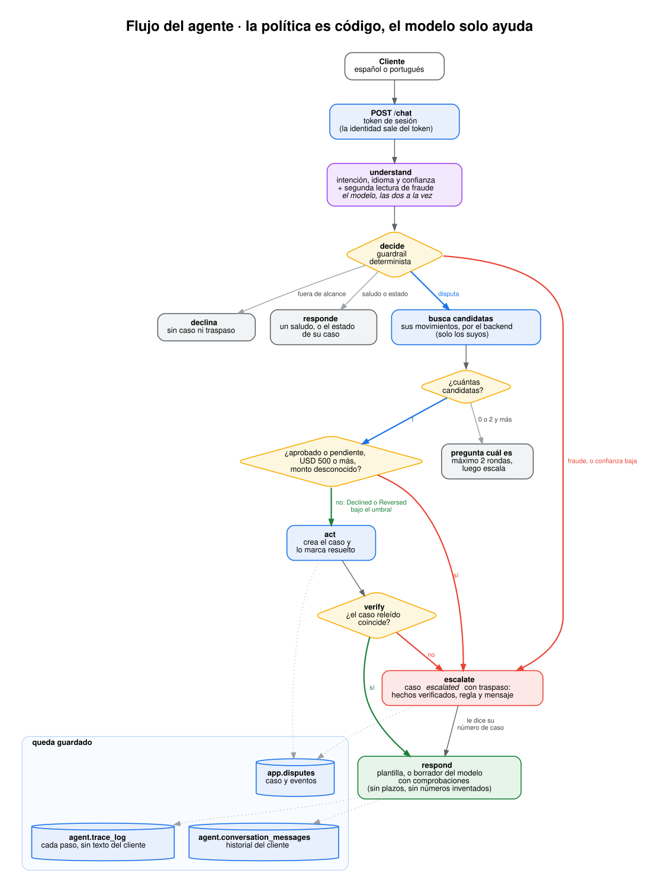
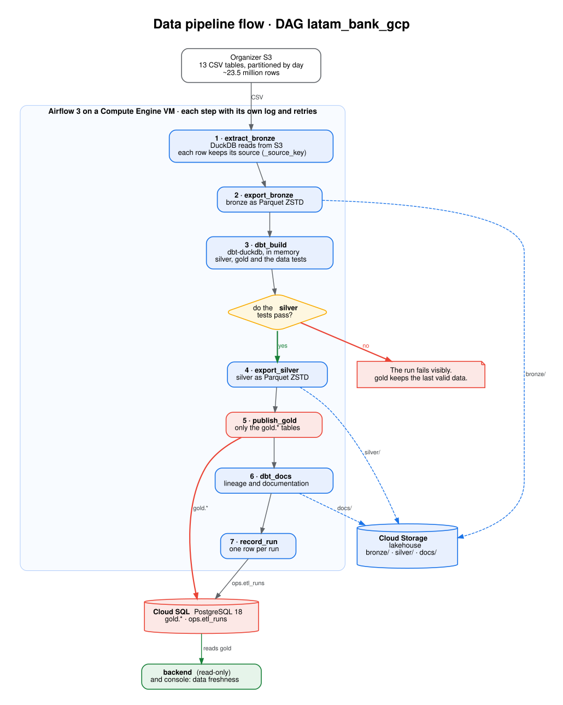
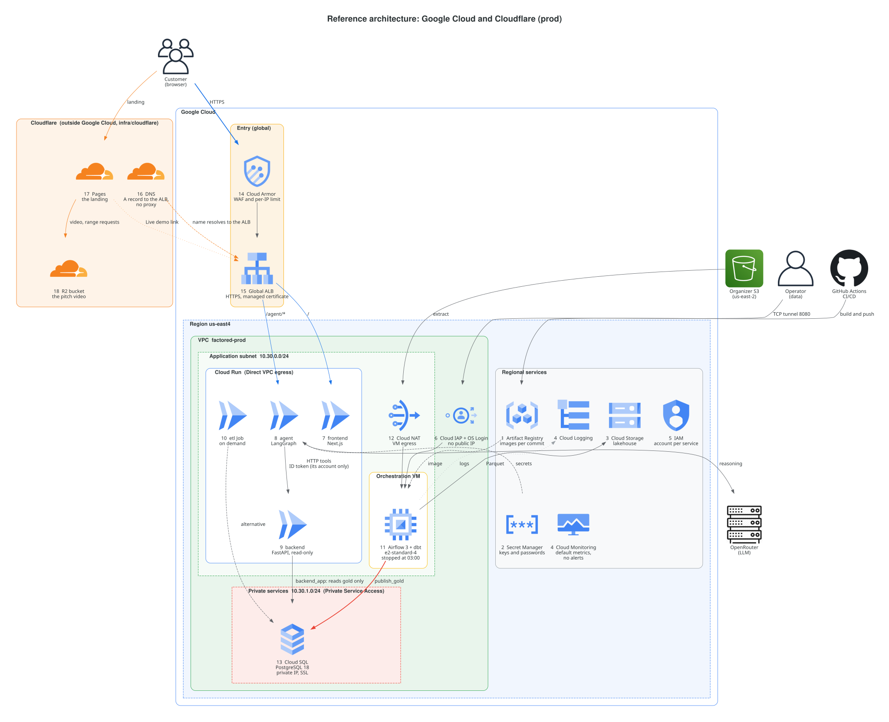

# Documentation

The LATAM Bank transaction dispute assistant, for the Factored AI & Data Hackathon 2026 (team bitcoders). This folder is the repository's only documentation. The challenge statement is in [`challenge/`](challenge/) and is not edited.

## Where to start

| If you want to... | Read |
|---|---|
| Understand what the assistant does and when it escalates | [Workflow](WORKFLOW.md) |
| See how it is built and deployed | [Architecture](ARCHITECTURE.md) |
| Learn what the dataset says and its limits | [Data](DATA.md) |
| Call the APIs or review the contract | [API](API.md) |
| Review the controls and the security findings | [Security](SECURITY.md) |
| See how the system was measured and the results | [Evaluation](EVALUATION.md) |
| See the evaluation of the ML components (intent and ranking) | [ML components](ML_FINDINGS.md) |
| Know what is missing for real production | [Path to production](PRODUCTION.md) |
| Deploy to production, step by step | [Deployment](DEPLOY.md) |
| Check what the challenge asks for and what is left | [Criteria](CRITERIA.md) |
| Run it on your machine | [Local development](LOCAL_DEV.md) |
| Record the pitch video | [Video script](PITCH_VIDEO.md) |
| Reach the GCP database and data (team) | [Onboarding](ONBOARDING.md) |

## Repository layout

| Folder | Contents |
|---|---|
| `backend/` | Tool layer: FastAPI, ownership-based permissions, cases and the specialist console |
| `agent/` | Conversational agent: LangGraph, deterministic guardrail, traces and history |
| `frontend/` | Next.js: the customer chat and the `/admin` console |
| `data/` | Pipeline: stages in `pipeline/` and the dbt project in `dbt/` |
| `ml/eval/` | Held-out sets and evaluation of the ML components (intent and transaction ranking) |
| `agent/eval/` | End-to-end evaluation of the system and of the intent classifier |
| `infra/gcp/` | Terraform per environment (`dev`, `qa`, `prod`) and modules |
| `infra/gcp/airflow/` | The Airflow image and DAG that run on the VM |
| `docs/diagrams/` | Architecture, flow and lineage diagrams |

## Diagrams

Sources are in [`diagrams/`](diagrams/): the flows are Graphviz (`*.dot`) and the deployment is `gcp_architecture.py`.

**Agent**

**Data pipeline**

**Deployment on GCP**

The lineage of the pipeline tables is in [`diagrams/dbt-lineage.svg`](diagrams/dbt-lineage.svg).
