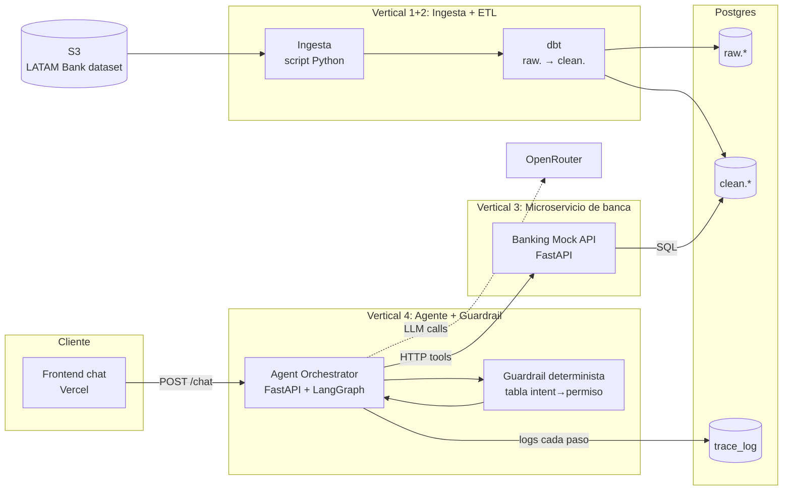
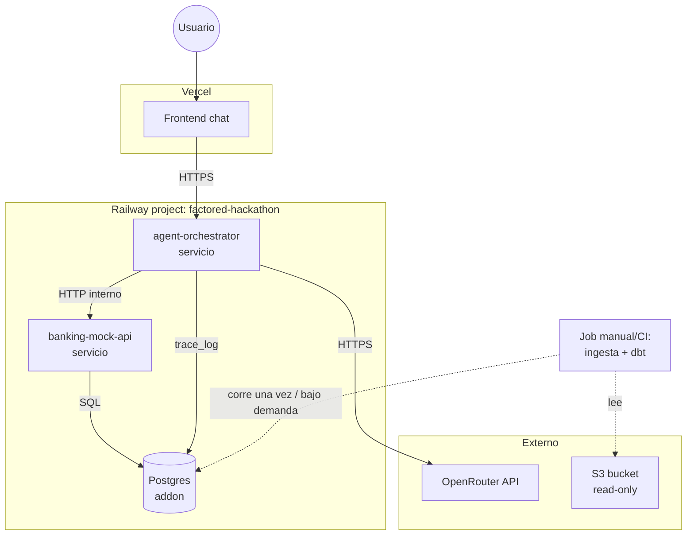

# Arquitectura por verticales

Versión reducida del pizarrón original (ver `arquitecture-bp.png`), recortada para 8 días con 3 personas y deploy en Railway + Vercel. Se organiza en 4 verticales para trabajar en paralelo. Workflow-agnóstica — no depende de cuál de las 4 opciones (A/B/C/D) gane el voto del equipo.

Se cae del pizarrón original: k8s/VMs, Kubeflow, Kafka, Temporal, streaming, blob storage. Razón: el reto no exige streaming ni multi-agente ni entrenar modelo propio, y cada una de esas piezas es días de setup que no hay.

## Big picture

## Diagrama de despliegue

## 1. Ingesta

**Responsabilidad:** bajar los CSVs particionados de S3 (bucket read-only del data dictionary) y volcarlos crudos a Postgres, sin transformar.

- Orquestado por **Airflow standalone** (1 solo contenedor — template `apache-airflow` en Railway, servicio `railwayapp-airflow`), no Airbyte. Airbyte quedó descartado: su modelo de despliegue por Docker Compose está descontinuado por el propio proyecto (el único camino soportado ahora es `abctl` sobre un clúster Kubernetes, que no encaja en Railway como "otro servicio más"). Ver intento fallido documentado más abajo.
- Un DAG simple: task de extracción (boto3, S3 → `raw.*`) → task de trigger de dbt (`dbt run` + `dbt test`).
- Destino: schema `raw.*` en Postgres (Railway), una tabla por tabla del dataset, columnas como texto — espejo fiel de lo que llegó (evidencia de lineage/auditoría).
- **Contrato de salida:** `raw.<tabla>` existe y tiene el mismo número de filas que S3 (contar y loggear al final de la carga).

### Por qué Airflow y no un script suelto

Con datos 100% estáticos, un orquestador no es necesario para que el pipeline *funcione* — pero si el equipo quiere mostrar re-ejecución programada, reintentos visibles y una UI de runs para el video pitch, Airflow standalone (single-container, sin Celery/Redis/K8s) da eso sin el costo de infraestructura de la topología completa. Es una elección de **presentación/observabilidad**, no de necesidad técnica: el reto es explícito en que con solo datos estáticos alcanza con "demonstrate update correctness with a clearly labeled test fixture", sin exigir streaming ni orquestación pesada.

### Escalabilidad (cómo se responde sin tener que correrlo)

El reto pide diseñar pensando en escalabilidad, no necesariamente demostrarla corriendo a escala en 8 días. Postura: pipeline por lotes, idempotente (cada carga puede re-correrse sin duplicar filas — `ON CONFLICT DO NOTHING`/`MERGE` en la task de carga), apuntando a un Postgres que se puede migrar a una instancia más grande sin cambiar código. Si los datos llegaran en streaming o creciera 10x el volumen, el punto de extensión es agregar un consumidor de eventos (Kafka/Kinesis) antes de la task de extracción y correr Airflow con CeleryExecutor multi-worker — documentado como camino de escalamiento, no implementado ahora.

### Intento fallido con Airbyte (documentado para la entrega — "report limitations")

Se intentó self-hostear Airbyte OSS 2.1.1 en Railway (server + worker, sin webapp — la imagen `airbyte/webapp:2.1.1` no existe, Airbyte discontinuó esa línea de versiones para self-host en contenedores sueltos). Requirió Temporal + Elasticsearch + Postgres dedicado además del server/worker, y depuración empírica de variables no documentadas (`WORKSPACE_ROOT`, `DATABASE_USER`, `AIRBYTE_URL`) vía logs de crash. Se abandonó al confirmar que Airbyte eliminó el soporte de Docker Compose y el único camino oficial (`abctl`) requiere un clúster Kubernetes completo. Fork con los fixes queda documentado en `diego-rejalas/railwayapp-airbyte-private` (privado) por si se retoma.

## 2. ETL / limpieza

**Responsabilidad:** transformar `raw.*` en `clean.*`, resolviendo lo que encontramos en `DATA_FINDINGS.md` (nulls, moneda MXN faltante, tipos, dedupe donde aplique).

- dbt sobre el mismo Postgres. Modelos `stg_*` (cast de tipos, nulls tratados) → modelos `clean_*` (joins resueltos, listos para que el tool layer los lea).
- Tests de dbt (`schema.yml`): `not_null`, `unique`, `accepted_values` sobre los campos clave (esto cubre "contratos de datos" y "quality checks" que pide el reto).
- Great Expectations no entra — dbt tests + pandera puntual si hace falta algo que dbt no cubre bien, sin levantar un servicio nuevo.
- **Contrato de salida:** `clean.<tabla>` versionado por los modelos dbt, con `dbt test` pasando en CI/manual antes de que el tool layer dependa de ellos.

## 3. Microservicio de banca (mock banking API)

**Responsabilidad:** es el "service/tool layer" que el reto exige explícitamente para enforced de permisos — "Enforce access to each customer's records and action permissions in the service or tool layer", no en el prompt del LLM.

- Un servicio FastAPI separado (Railway), con endpoints REST deterministas: `GET /customers/{id}`, `GET /customers/{id}/transactions`, `POST /cases`, `POST /cards/{id}/block`, etc. — según el workflow que gane el voto.
- Cada endpoint valida sesión/permiso **antes** de tocar `clean.*` — esto es lo único que de verdad se beneficia de ser un servicio aparte (aísla el enforcement de permisos del código del agente, para que quede claro en la demo/video que la política no vive en el prompt).
- Lee de `clean.*` en Postgres.
- **Por qué sí separarlo (y no meterlo en el mismo proceso del agente):** es la pieza que el reto pide mostrar explícitamente como "fuera del modelo" — tenerla como servicio HTTP propio, con sus propios logs, hace la separación obvia y fácil de explicar en el video pitch. Es el único microservicio real que vale la pena con el tiempo que hay; todo lo demás se queda en un solo proceso.
- **Contrato:** OpenAPI expuesto por FastAPI (gratis con FastAPI), documentado como "mock banking tool" con sus límites (qué simula, qué no) — cumple el requisito de documentar contratos de sandbox services.

## 4. Agente + guardrail

**Responsabilidad:** el orquestador conversacional. Habla con el usuario, decide, llama al microservicio de banca, verifica, escala.

- Servicio FastAPI separado (Railway) con LangGraph adentro. Grafo con nodos explícitos: `understand → decide → act → verify → escalate`.
- Las "tools" del agente son clientes HTTP delgados al microservicio de banca (vertical 3) — el LLM nunca toca Postgres directo.
- **Guardrail determinista:** vive en el nodo `decide`, ANTES de `act`. Es una tabla/config (no un prompt) que dice qué tool puede invocarse según intent detectado + estado de sesión/autenticación. Si falta permiso o falta info → fuerza camino de aclaración o abstención, no deja que el LLM decida solo.
- Verificación: después de que `act` llama al microservicio de banca, `verify` vuelve a consultar el estado (no confía en que el LLM "diga" que funcionó).
- LLM vía OpenRouter (flexibilidad de modelo/fallback).
- Logging estructurado de cada paso del grafo a `trace_log` en Postgres — evidencia de auditoría para el handoff a humano y para el reporte de evaluación.
- **Contrato:** expone `POST /chat` al frontend; nunca expone acceso directo a la base de datos ni al microservicio de banca desde el cliente.

## Mapa de servicios a desplegar (mínimo viable)

| Servicio | Plataforma | Contiene |
|---|---|---|
| Postgres | Railway (addon) | `raw.*`, `clean.*`, `trace_log` |
| banking-mock-api | Railway | Vertical 3 |
| agent-orchestrator | Railway | Vertical 4 (LangGraph + guardrail) |
| frontend (chat) | Vercel | UI de chat |
| ingesta + dbt | se corren como jobs/scripts, no quedan como servicio corriendo 24/7 |

Total: 2 servicios de aplicación en Railway + 1 Postgres + 1 frontend en Vercel. Nada de k8s, Kafka, Temporal, Kubeflow.

## Configuración de Railway como código

Lección de la sesión: configurar servicios a mano (dashboard o vía MCP) es rápido pero no queda versionado ni es reproducible por otra persona del equipo — así se armó y desarmó Airbyte sin dejar rastro reproducible. Convención a seguir de acá en adelante:

- Cada servicio de la app (`banking-mock-api`, `agent-orchestrator`) tiene su propio `railway.toml` en la raíz de su carpeta (mismo patrón usado para `worker/railway.toml` y `webapp/railway.toml` en el fork de Airbyte): builder, healthcheck, restart policy — todo en el repo, no seteado a mano.
- Variables de entorno con secretos (API keys) siguen en Railway (nunca en el repo), pero sus *nombres* y de dónde vienen (qué servicio las provee, ej. `${{Postgres.DATABASE_URL}}`) se documentan en un `.env.example` por servicio, igual que ya hace el template de Airflow/Airbyte.
- El repo `railwayapp-airbyte-private` con los fixes queda como referencia local (el equipo lo va a clonar), no como servicio activo en Railway.

## Próximo paso

Falta definir, una vez el equipo vote el workflow: los endpoints exactos del microservicio de banca, los intents/tools del agente, y las reglas concretas del guardrail (qué se auto-resuelve, qué escala) — eso ya es específico de la Opción A/B/C/D elegida, no de esta arquitectura base.
