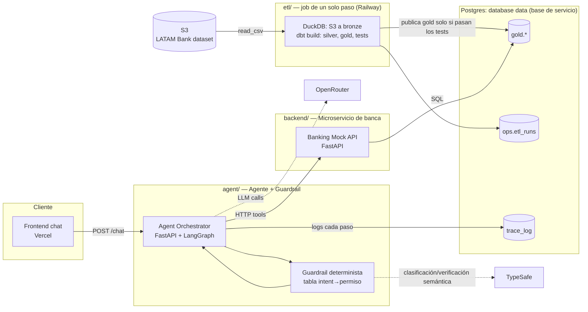
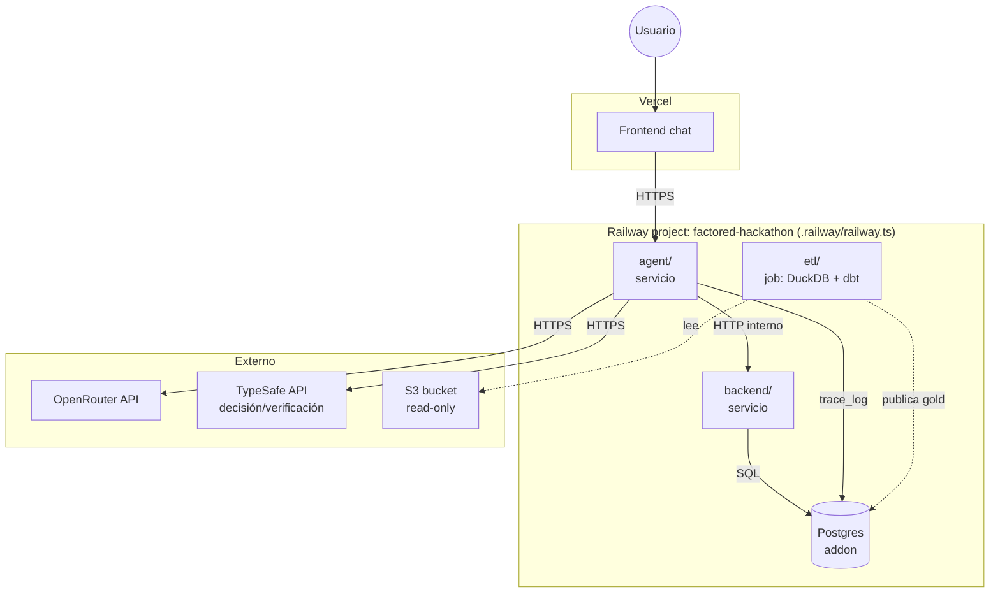
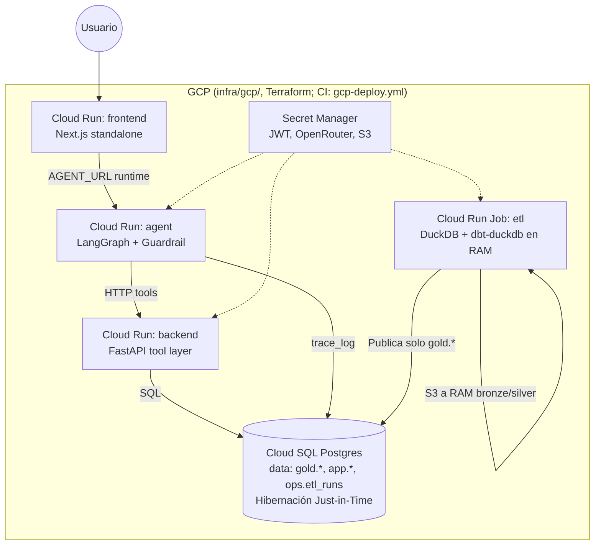

# Arquitectura por verticales

Versión reducida del pizarrón original (ver `arquitecture-bp.png`), recortada para 8 días con 3 personas y deploy en Railway + Vercel. Se organiza en 4 verticales para trabajar en paralelo. Workflow-agnóstica — no depende de cuál de las 4 opciones (A/B/C/D) gane el voto del equipo.

Se cae del pizarrón original: k8s/VMs, Kubeflow, Kafka, Temporal, streaming, blob storage. Razón: el reto no exige streaming ni multi-agente ni entrenar modelo propio, y cada una de esas piezas es días de setup que no hay.

## Big picture

## Diagrama de despliegue

## 1. ETL: un solo job con DuckDB (`etl/`)

**Responsabilidad:** llevar el dataset del organizador (CSV en S3) hasta tablas `gold` en Postgres, listas para que las lea el tool layer, con la calidad de datos comprobada antes de publicar.

Un solo proceso (`etl/run.py`) que corre hasta terminar:

1. **Extraer y cargar.** DuckDB lee los CSV directo de S3 (`read_csv` con `hive_partitioning` y `filename`) a tablas `bronze.*`, todo como texto. El archivo de origen de cada fila queda en `_source_key` y la hora de carga en `_ingested_at`: el linaje sale de la lectura, sin tabla de control aparte.
2. **Transformar y probar.** `dbt build` con dbt-duckdb sobre el mismo archivo: 13 vistas `silver.*`, 5 tablas `gold.*` y 121 tests. Cada modelo se prueba antes de construir los que dependen de él.
3. **Publicar.** Solo si el paso 2 no tuvo errores, las tablas gold se copian a Postgres, se indexan y se intercambian todas a la vez en una sola transacción. Si algún test falla, Postgres conserva el último gold válido.

Cada corrida deja una fila en `ops.etl_runs` (cuándo corrió, si pasó, conteos por tabla y resultado de los tests).

**Medido en Railway (2026-09-30):** 23,5 millones de filas de 13 tablas cargadas desde S3 en ~2 min, `dbt build` completo (139 nodos) en 22 s, publicación a Postgres en ~2 min: **~4,7 min de pared** de punta a punta. Antes: Airflow + loader propio + dbt sobre Postgres, unos 10 minutos como mínimo, con 3 servicios. El resultado es idéntico: mismos conteos en las 13 tablas y sumas de importes iguales al centavo en gold.

### Por qué un job con DuckDB y no Airflow + Postgres

- **Menos piezas.** Se retiran tres servicios (Airflow, su Postgres de metadatos, el runner HTTP de dbt), el loader en Python y 7,3 GB de bronze en texto dentro de Postgres. Queda un job efímero: el archivo de DuckDB se reconstruye en cada corrida y pesa 1,4 GB.
- **Más rápido y más simple de razonar.** Sin ledger ni reintentos por archivo: la corrida completa se puede repetir y siempre da el mismo resultado.
- **Se conserva lo que aporta valor:** el proyecto dbt (modelos, 121 tests, documentación) y la garantía de no publicar datos que no pasaron los tests.
- **Lo que se pierde, dicho con honestidad:** la UI de corridas de Airflow y su reintento por tarea. Se compensa con `ops.etl_runs`, los logs del job y una política de reintentos acotada en Railway (`ON_FAILURE`, 3 intentos).

### Escalabilidad (cómo se responde sin tener que correrlo)

El job relee todo S3 en cada corrida; a 23,5M filas eso cuesta ~2 min y cabe holgado en un nodo (pico de ~4 GB de memoria). Si el volumen creciera 10x, los puntos de extensión son filtrar por partición (`year/month/day` ya viene como columna) y pasar `transactions` y `digital_events` a modelos incrementales; más allá de un nodo, DuckDB deja de ser la herramienta. Documentado como camino de escalamiento, no implementado.

### Intento fallido con Airbyte (documentado para la entrega — "report limitations")

Se intentó self-hostear Airbyte OSS 2.1.1 en Railway (server + worker, sin webapp — la imagen `airbyte/webapp:2.1.1` no existe, Airbyte discontinuó esa línea de versiones para self-host en contenedores sueltos). Requirió Temporal + Elasticsearch + Postgres dedicado además del server/worker, y depuración empírica de variables no documentadas (`WORKSPACE_ROOT`, `DATABASE_USER`, `AIRBYTE_URL`) vía logs de crash. Se abandonó al confirmar que Airbyte eliminó el soporte de Docker Compose y el único camino oficial (`abctl`) requiere un clúster Kubernetes completo. Fork con los fixes queda documentado en `diego-rejalas/railwayapp-airbyte-private` (privado) por si se retoma.

## 2. Calidad de datos y modelado (dbt dentro del job)

**Responsabilidad:** resolver lo que encontramos en `DATA_FINDINGS.md` (nulos, moneda MXN faltante, tipos, valores inconsistentes) y dejar `gold` listo para consumo. Proyecto en `data/dbt/`.

- Modelos `stg_*` en `silver` para las 13 tablas (tipos reales, vacío a nulo, 'Mexico' y 'México' conformados) y modelos por entidad en `gold` (sin prefijo `clean_`: medallion reserva la limpieza para silver). Hoy gold es pass-through de silver; los joins de negocio llegan con el workflow elegido.
- 121 tests como contratos de datos: claves, claves foráneas entre todas las tablas, valores aceptados, rangos y reglas de negocio. Los defectos conocidos del dataset corren como advertencias (`severity: warn`) con su conteo, para que aparezcan en cada corrida sin bloquearla.
- **Contrato de salida:** `gold.<tabla>` en Postgres con todos los tests sin errores; si no, no se publica.

## 3. Microservicio de banca (mock banking API) — `backend/`

**Responsabilidad:** es el "service/tool layer" que el reto exige explícitamente para enforced de permisos — "Enforce access to each customer's records and action permissions in the service or tool layer", no en el prompt del LLM.

- Un servicio FastAPI separado (Railway), con endpoints REST deterministas: `GET /customers/{id}`, `GET /customers/{id}/transactions`, `POST /cases`, `POST /cards/{id}/block`, etc. — según el workflow que gane el voto.
- Cada endpoint valida sesión/permiso **antes** de tocar `data.gold.*` — esto es lo único que de verdad se beneficia de ser un servicio aparte (aísla el enforcement de permisos del código del agente, para que quede claro en la demo/video que la política no vive en el prompt).
- Lee de `data.gold.*` en Postgres.
- **Por qué sí separarlo (y no meterlo en el mismo proceso del agente):** es la pieza que el reto pide mostrar explícitamente como "fuera del modelo" — tenerla como servicio HTTP propio, con sus propios logs, hace la separación obvia y fácil de explicar en el video pitch. Es el único microservicio real que vale la pena con el tiempo que hay; todo lo demás se queda en un solo proceso.
- **Contrato:** OpenAPI expuesto por FastAPI (gratis con FastAPI), documentado como "mock banking tool" con sus límites (qué simula, qué no) — cumple el requisito de documentar contratos de sandbox services.

## 4. Agente + guardrail — `agent/`

**Responsabilidad:** el orquestador conversacional. Habla con el usuario, decide, llama al microservicio de banca, verifica, escala.

- Servicio FastAPI separado (Railway) con LangGraph adentro. Grafo con nodos explícitos: `understand → decide → act → verify → escalate`.
- Las "tools" del agente son clientes HTTP delgados al microservicio de banca (vertical 3) — el LLM nunca toca Postgres directo.
- **Guardrail determinista:** vive en el nodo `decide`, ANTES de `act`. Es una tabla/config (no un prompt) que dice qué tool puede invocarse según intent detectado + estado de sesión/autenticación. Si falta permiso o falta info → fuerza camino de aclaración o abstención, no deja que el LLM decida solo.
- **TypeSafe (`docs.typesafe.ai`)** como capa de decisión/verificación semántica dentro del guardrail — no reemplaza LangGraph (que sigue orquestando el grafo), se usa puntual en dos puntos: (1) clasificación de intent en `decide` sin gastar una llamada a LLM completo por cada mensaje, (2) verificación del output del agente en `verify` antes de dejarlo ejecutar la tool. Control de flujo sigue en código (LangGraph + guardrail), TypeSafe solo aporta el chequeo semántico barato — cumple el mismo principio de "policy fuera del prompt" que ya pedía el reto.
- Verificación: después de que `act` llama al microservicio de banca, `verify` vuelve a consultar el estado (no confía en que el LLM "diga" que funcionó).
- LLM vía OpenRouter (flexibilidad de modelo/fallback).
- Logging estructurado de cada paso del grafo a `trace_log` en Postgres — evidencia de auditoría para el handoff a humano y para el reporte de evaluación.
- **Contrato:** expone `POST /chat` al frontend; nunca expone acceso directo a la base de datos ni al microservicio de banca desde el cliente.

## Mapa de servicios a desplegar (mínimo viable)

| Servicio | Carpeta | Plataforma | Contiene | Grupo Railway |
|---|---|---|---|---|
| Postgres | — (addon) | Railway | base `data`: `gold.*`, `ops.etl_runs`, `trace_log` (bronze y silver viven en DuckDB, dentro del job) | Data Pipeline |
| etl | `etl/` (+ `data/dbt/`) | Railway | Vertical 1 y 2 (job: DuckDB + dbt) | Data Pipeline |
| backend | `backend/` | Railway | Vertical 3 | — |
| agent | `agent/` | Railway | Vertical 4 (LangGraph + guardrail) | — |
| frontend | `frontend/` | Vercel | UI de chat | — |

Total: 3 servicios de aplicación en Railway (`etl` es un job que corre y termina; `backend/` y `agent/` son servicios) + 1 Postgres + 1 frontend en Vercel. Nada de k8s, Kafka, Temporal, Kubeflow.

Externo (SaaS, sin servicio propio en Railway): OpenRouter (LLM calls) y **TypeSafe** (decisión/verificación semántica, consumido por `agent/` vía API — ver Vertical 4).

## Configuración de Railway como código

Lección de la sesión: configurar servicios a mano (dashboard o vía MCP) es rápido pero no queda versionado ni es reproducible por otra persona del equipo — así se armó y desarmó Airbyte sin dejar rastro reproducible.

Railway deprecó `railway.toml`/`railway.json` (Config as Code, corte duro 2026-12-01) a favor de **Infrastructure as Code**: un único archivo `.railway/railway.ts` en la raíz del repo, gestionado con la Railway CLI (`railway config plan` / `railway config apply`). Convención del proyecto:

- **Un solo archivo `.railway/railway.ts`** declara todos los servicios, volúmenes y la base de datos del proyecto — build, healthcheck, restart policy, montajes de volumen, y qué variables se preservan (`preserve()` para secretos que ya viven en Railway, nunca en el repo).
- Cada servicio (`etl/`, `backend/`, `agent/`) sigue teniendo su propio `Dockerfile` y `.env.example` en su carpeta (documentación de qué variables necesita), pero el *despliegue* (qué servicio existe, con qué config) se define en el `.railway/railway.ts` único, no en un `railway.toml` por carpeta.
- Flujo: `railway config plan` (previsualiza, nunca escribe nada) → revisar → `railway config apply` (confirma antes de aplicar; cambios destructivos requieren confirmación explícita).
- El repo `railwayapp-airbyte-private` con los fixes de Airbyte queda como referencia local (por si se retoma), no como servicio activo en Railway ni en el IaC.

## Despliegue primario en GCP (migración completa)

Decisión registrada (2026-10-01): el stack se **migra por completo a GCP** en
la rama `feat/app-layer` — GCP pasa a ser el despliegue primario y Railway
queda como legacy en transición (`.railway/railway.ts` ya no se aplica; su
teardown es posterior a la verificación del stack nuevo). Mismo código, mismos
Dockerfiles; el frontend también vive en GCP (Next.js standalone con
`AGENT_URL` como env de runtime).

Mapa y decisiones:

| Pieza Railway/Vercel (legacy) | En GCP (primario) | Código |
|---|---|---|
| Postgres `data` | Cloud SQL PostgreSQL 16 (solo `gold.*`, `app.*`, `ops.*`) | Modo Just-in-Time (`./manage_db.sh pause/resume`) |
| backend / agent | Cloud Run (mismos Dockerfiles) | sin cambios |
| frontend (Vercel) | Cloud Run `frontend` (Next.js standalone); `AGENT_URL` en runtime | `output: standalone` + URL por prop |
| pipeline (`etl/` job) | Cloud Run Job `etl`: DuckDB + `dbt-duckdb` en RAM | Procesamiento en RAM en 2.5 min; sin microservicio web `dbt`; esquemas crudos purgados |
| `railway.ts` | Terraform (`infra/gcp/`) + `gcp-deploy.yml` | Equivalente declarativo con variable `db_activation_policy` |
| secretos (`preserve()`) | Secret Manager (JWT autogenerado; S3/LLM se copian) | Gestionado con Google Secret Manager |

Decisiones clave de optimización:
1. **DuckDB y dbt en RAM efímera:** Se eliminó el microservicio independiente `dbt` de Cloud Run. El Job `etl` procesa los 23.5M de filas crudas y ejecuta los 121 tests en la RAM del contenedor (`/tmp/latam.duckdb`) en ~2.5 minutos, publicando únicamente las tablas `gold.*` finales a Cloud SQL.
2. **Hibernación Just-in-Time:** Cloud SQL soporta apagado de cómputo e IP mediante política `NEVER` cuando no está en uso, reduciendo el costo de operación en reposo a ~$0.05 USD/día y reactivándose en 60 segundos para demostraciones.

## Próximo paso

Falta definir, una vez el equipo vote el workflow: los endpoints exactos del microservicio de banca, los intents/tools del agente, y las reglas concretas del guardrail (qué se auto-resuelve, qué escala) — eso ya es específico de la Opción A/B/C/D elegida, no de esta arquitectura base.
