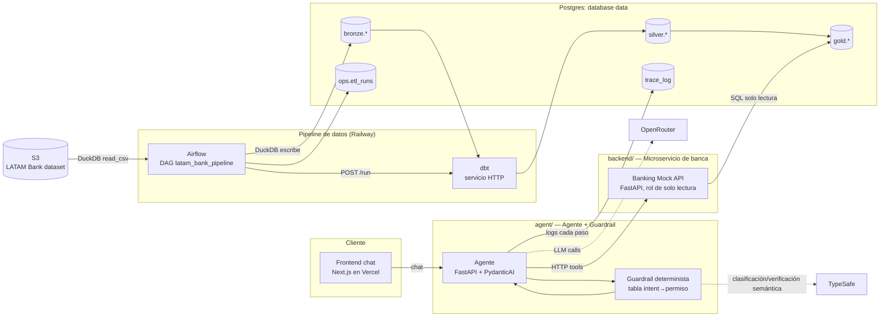
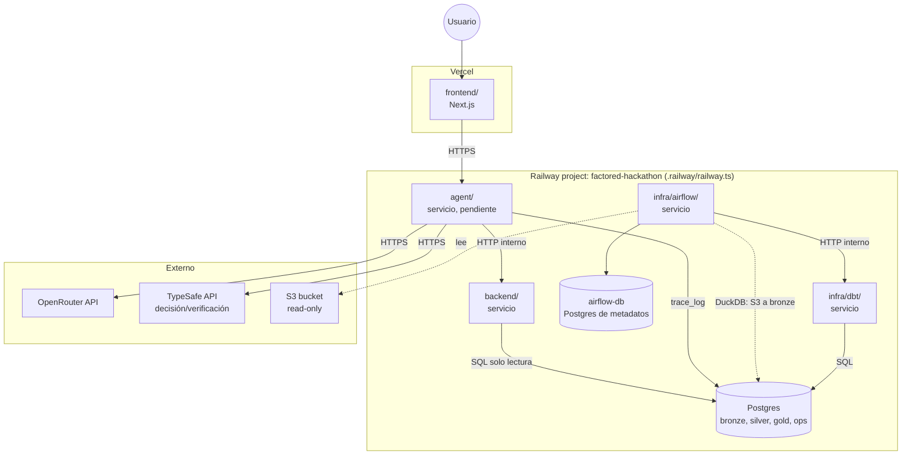

# Arquitectura por verticales

Versión reducida del pizarrón original (ver `arquitecture-bp.png`), recortada para 8 días con 3 personas y deploy en Railway (datos, backend, agente) + Vercel (frontend). Se organiza en 5 verticales para trabajar en paralelo. Workflow-agnóstica — no depende de cuál de las 4 opciones (A/B/C/D) gane el voto del equipo.

Se cae del pizarrón original: k8s/VMs, Kubeflow, Kafka, Temporal, streaming, blob storage. Razón: el reto no exige streaming ni multi-agente ni entrenar modelo propio, y cada una de esas piezas es días de setup que no hay.

## Big picture



## Diagrama de despliegue



Hoy el frontend llama al backend directamente (el backend tiene URL pública temporal); cuando exista el agente, el frontend hablará con el agente y el backend volverá a ser privado.

## 1. Extracción y carga: DuckDB, orquestado por Airflow

**Responsabilidad:** llevar los CSV del organizador (S3) hasta tablas `bronze` en Postgres, sin transformarlos, y disparar la transformación.

El DAG `latam_bank_pipeline` (`data/dags/`) corre en Airflow:

```
bootstrap -> extract_load x 13 (en paralelo, máx. 6) -> dbt_build -> record_run
```

- **Extraer y cargar en una sola sentencia.** Por cada tabla, DuckDB lee los CSV de S3 (`read_csv` con `hive_partitioning` y `filename`) y los escribe en Postgres con su extensión `postgres`: `CREATE TABLE pg.bronze.<tabla> AS SELECT ... FROM read_csv('s3://...')`. No hay un cargador aparte. Cada tabla queda como copia fiel (todo texto) más dos columnas de linaje: `_source_key` (el objeto de S3 del que salió la fila) y `_ingested_at`.
- **Recarga completa en cada corrida** (`DROP ... CASCADE` y `CREATE`): el dataset es un snapshot estático, así que recargar todo es lo más simple y siempre correcto. Nada lee bronze salvo dbt, y el backend solo lee gold, por eso la ventana de recarga es inocua.
- **Reintentos:** las cargas reintentan 2 veces; `dbt_build` no reintenta (un test fallido no debe repetirse durante minutos).
- **`record_run`** deja una fila por corrida exitosa en `ops.etl_runs` (cuándo corrió y qué movió).

**Por qué DuckDB para extraer y cargar:** lee S3 en paralelo sin bajar los archivos y escribe a Postgres en la misma sentencia. Reemplazó a un cargador en Python de ~290 líneas (polars, boto3, una tabla de control de archivos). **Medido en Railway (2026-09-30), corrida completa del DAG:** 16 de 16 tareas correctas en ~21 minutos de pared. DuckDB lee las 13 tablas (23,5 millones de filas) desde S3 en ~2,5 minutos cuando solo las lee; el costo está en **escribirlas a Postgres**, y es muy desigual: `digital_events` (15,6M filas) tarda ~15,7 min y es la tarea que fija el total, `transactions` (4,4M) ~7 min, `campaign_sends` ~4 min, el resto menos de 4 min. `dbt build` (133 tests pasados, 6 avisos de defectos conocidos, 0 errores) tarda ~3,3 min. Se validó que el resultado es idéntico a las implementaciones anteriores: conteos exactos en las 13 tablas y 11 sumas de `gold` iguales al centavo.

**El precio de esta arquitectura:** mantener bronze, silver y gold en Postgres con Airflow cuesta ~21 min, contra ~4,7 min del job único con DuckDB que se probó antes. `digital_events` y `campaign_sends` no los usa ningún workflow candidato y suman ~20 de esos minutos: omitirlas de la carga (o cargarlas aparte) llevaría la corrida a ~8 min, con `transactions` como tarea más larga.

### Por qué Airflow
Orquesta con reintentos por tarea, paralelismo acotado, UI de corridas y programación, y es lo que muestra el orden de las dependencias (dbt solo corre cuando las 13 cargas terminaron). Con datos estáticos no es imprescindible para que el pipeline funcione; es una decisión de observabilidad y de demostrar orquestación. Su metadata vive en un Postgres propio (`airflow-db`), separado del de datos.

### Escalabilidad (cómo se responde sin tener que correrlo)
La carga completa cabe holgada en un nodo. Si el volumen creciera 10x, los puntos de extensión son filtrar por partición (`year/month/day` ya viene como columna) y pasar `transactions` y `digital_events` a modelos incrementales en dbt; más allá, mover la metadata de Airflow a varios workers (CeleryExecutor). Documentado como camino de escalamiento, no implementado.

### Intento fallido con Airbyte (documentado para la entrega — "report limitations")

Se intentó self-hostear Airbyte OSS 2.1.1 en Railway (server + worker, sin webapp — la imagen `airbyte/webapp:2.1.1` no existe, Airbyte discontinuó esa línea de versiones para self-host en contenedores sueltos). Requirió Temporal + Elasticsearch + Postgres dedicado además del server/worker, y depuración empírica de variables no documentadas (`WORKSPACE_ROOT`, `DATABASE_USER`, `AIRBYTE_URL`) vía logs de crash. Se abandonó al confirmar que Airbyte eliminó el soporte de Docker Compose y el único camino oficial (`abctl`) requiere un clúster Kubernetes completo. Fork con los fixes queda documentado en `diego-rejalas/railwayapp-airbyte-private` (privado) por si se retoma.

## 2. Transformación y calidad de datos: dbt sobre Postgres

**Responsabilidad:** resolver lo que encontramos en `DATA_FINDINGS.md` (nulos, moneda MXN faltante, tipos, valores inconsistentes) y dejar `gold` listo para consumo. Proyecto en `data/dbt/`, corre como servicio propio (`infra/dbt/`) al que el DAG llama por HTTP.

- **dbt en su propio servicio:** las dependencias de dbt (`isodate`, `pathspec`) chocan con las versiones exactas que fija el archivo de constraints de Airflow, y además queda visible como pieza propia. El runner ejecuta `dbt build` con un candado para no correr dos a la vez.
- Modelos `stg_*` en `silver` para las 13 tablas (tipos reales, vacío a nulo, 'Mexico' y 'México' conformados) y modelos por entidad en `gold` (sin prefijo `clean_`: medallion reserva la limpieza para silver). Hoy gold es pass-through de silver; los joins de negocio llegan con el workflow elegido. Bronze, silver y gold quedan visibles en una sola base.
- 121 tests como contratos de datos: claves, claves foráneas entre todas las tablas, valores aceptados, rangos y reglas de negocio. Los defectos conocidos del dataset corren como advertencias (`severity: warn`) con su conteo, para que aparezcan en cada corrida sin bloquearla.
- `dbt build` prueba cada modelo antes de construir los que dependen de él: si un test de silver falla, gold no se reconstruye y conserva el último dato válido.

## 3. Microservicio de banca (mock banking API) — `backend/`

**Responsabilidad:** es el "service/tool layer" que el reto exige explícitamente para enforced de permisos — "Enforce access to each customer's records and action permissions in the service or tool layer", no en el prompt del LLM.

- Un servicio FastAPI separado (Railway), con endpoints REST deterministas: `GET /customers/{id}`, `GET /customers/{id}/transactions`, `POST /cases`, `POST /cards/{id}/block`, etc. — según el workflow que gane el voto.
- Cada endpoint valida sesión/permiso **antes** de tocar `data.gold.*` — esto es lo único que de verdad se beneficia de ser un servicio aparte (aísla el enforcement de permisos del código del agente, para que quede claro en la demo/video que la política no vive en el prompt).
- Lee de `data.gold.*` en Postgres **con un rol de solo lectura** (`backend_ro`: `SELECT` sobre `gold` y `ops`, sin acceso a `silver` ni `bronze`), y cada sesión arranca con `default_transaction_read_only=on` y un `statement_timeout`: aunque un endpoint tuviera un bug, no puede escribir.
- **Estado hoy (cascarón):** `GET /health`, `GET /health/db` y `GET /meta/data` (conteos de `gold` y última corrida del pipeline, solo agregados). Ningún endpoint devuelve datos de clientes hasta tener la autenticación por sesión de prueba. Tiene URL pública temporal porque el frontend lo consulta directo; con el agente volverá a ser privado.
- **Por qué sí separarlo (y no meterlo en el mismo proceso del agente):** es la pieza que el reto pide mostrar explícitamente como "fuera del modelo" — tenerla como servicio HTTP propio, con sus propios logs, hace la separación obvia y fácil de explicar en el video pitch. Es el único microservicio real que vale la pena con el tiempo que hay; todo lo demás se queda en un solo proceso.
- **Contrato:** OpenAPI expuesto por FastAPI (gratis con FastAPI), documentado como "mock banking tool" con sus límites (qué simula, qué no) — cumple el requisito de documentar contratos de sandbox services.

## 4. Agente + guardrail — `agent/`

**Responsabilidad:** el orquestador conversacional. Habla con el usuario, decide, llama al microservicio de banca, verifica, escala.

- Servicio FastAPI separado (Railway) con **PydanticAI** adentro. El flujo tiene pasos explícitos: `understand → decide → act → verify → escalate` (con `pydantic-graph` si hace falta un grafo de estados explícito).
- **Por qué PydanticAI:** las herramientas y las salidas del agente son modelos Pydantic, así que un dato mal formado se rechaza en vez de llegar al usuario; las dependencias (cliente del backend, sesión autenticada) se inyectan en cada herramienta, lo que hace el guardrail testeable sin un LLM; y trae un adaptador para el protocolo del SDK de chat de Vercel (`VercelAIAdapter`, compatible con `useChat`), que conecta directo con un frontend Next.js en Vercel.
- Las "tools" del agente son clientes HTTP delgados al microservicio de banca (vertical 3), tipadas con los modelos de `backend/app/schemas.py` — el LLM nunca toca Postgres directo.
- **Guardrail determinista:** vive en el nodo `decide`, ANTES de `act`. Es una tabla/config (no un prompt) que dice qué tool puede invocarse según intent detectado + estado de sesión/autenticación. Si falta permiso o falta info → fuerza camino de aclaración o abstención, no deja que el LLM decida solo.
- **TypeSafe (`docs.typesafe.ai`)** como capa de decisión/verificación semántica dentro del guardrail — no reemplaza a PydanticAI (que sigue orquestando el flujo), se usa puntual en dos puntos: (1) clasificación de intent en `decide` sin gastar una llamada a LLM completo por cada mensaje, (2) verificación del output del agente en `verify` antes de dejarlo ejecutar la tool. Control de flujo sigue en código (PydanticAI + guardrail), TypeSafe solo aporta el chequeo semántico barato — cumple el mismo principio de "policy fuera del prompt" que ya pedía el reto.
- Verificación: después de que `act` llama al microservicio de banca, `verify` vuelve a consultar el estado (no confía en que el LLM "diga" que funcionó).
- LLM vía OpenRouter (flexibilidad de modelo/fallback).
- Logging estructurado de cada paso a `trace_log` en Postgres — evidencia de auditoría para el handoff a humano y para el reporte de evaluación.
- **Contrato:** expone el endpoint de chat al frontend (stream compatible con el SDK de Vercel); nunca expone acceso directo a la base de datos ni al microservicio de banca desde el cliente.

## Mapa de servicios a desplegar (mínimo viable)

| Servicio | Carpeta | Plataforma | Contiene | Grupo Railway |
|---|---|---|---|---|
| postgres | — (addon) | Railway | base `data`: `bronze.*`, `silver.*`, `gold.*`, `ops.etl_runs`, `trace_log` | Data Pipeline |
| airflow | `infra/airflow/` (+ `data/dags/`) | Railway | Vertical 1: orquesta; DuckDB extrae y carga a bronze | Data Pipeline |
| airflow-db | — (addon) | Railway | metadata de Airflow | Data Pipeline |
| dbt | `infra/dbt/` (+ `data/dbt/`) | Railway | Vertical 2: bronze → silver → gold, 121 tests | Data Pipeline |
| backend | `backend/` | Railway | Vertical 3 (tool layer, rol de solo lectura) | App |
| agent | `agent/` | Railway | Vertical 4 (PydanticAI + guardrail), pendiente | App |
| frontend | `frontend/` | Vercel | UI de chat (Next.js) | — |

Total: 4 servicios de aplicación en Railway (`airflow`, `dbt`, `backend`, `agent`) + 2 Postgres (datos y metadata de Airflow) + 1 frontend en Vercel. Nada de k8s, Kafka, Temporal, Kubeflow.

Externo (SaaS, sin servicio propio en Railway): OpenRouter (LLM calls) y **TypeSafe** (decisión/verificación semántica, consumido por `agent/` vía API — ver Vertical 4).

## Configuración de Railway como código

Lección de la sesión: configurar servicios a mano (dashboard o vía MCP) es rápido pero no queda versionado ni es reproducible por otra persona del equipo — así se armó y desarmó Airbyte sin dejar rastro reproducible.

Railway deprecó `railway.toml`/`railway.json` (Config as Code, corte duro 2026-12-01) a favor de **Infrastructure as Code**: un único archivo `.railway/railway.ts` en la raíz del repo, gestionado con la Railway CLI (`railway config plan` / `railway config apply`). Convención del proyecto:

- **Un solo archivo `.railway/railway.ts`** declara todos los servicios, volúmenes y la base de datos del proyecto — build, healthcheck, restart policy, montajes de volumen, y qué variables se preservan (`preserve()` para secretos que ya viven en Railway, nunca en el repo).
- Cada servicio (`infra/airflow/`, `infra/dbt/`, `backend/`, `agent/`) sigue teniendo su propio `Dockerfile` y `.env.example` en su carpeta (documentación de qué variables necesita), pero el *despliegue* (qué servicio existe, con qué config) se define en el `.railway/railway.ts` único, no en un `railway.toml` por carpeta.
- Flujo: `railway config plan` (previsualiza, nunca escribe nada) → revisar → `railway config apply` (confirma antes de aplicar; cambios destructivos requieren confirmación explícita).
- El repo `railwayapp-airbyte-private` con los fixes de Airbyte queda como referencia local (por si se retoma), no como servicio activo en Railway ni en el IaC.

## Próximo paso

Falta definir, una vez el equipo vote el workflow: los endpoints exactos del microservicio de banca, los intents/tools del agente, y las reglas concretas del guardrail (qué se auto-resuelve, qué escala) — eso ya es específico de la Opción A/B/C/D elegida, no de esta arquitectura base.
